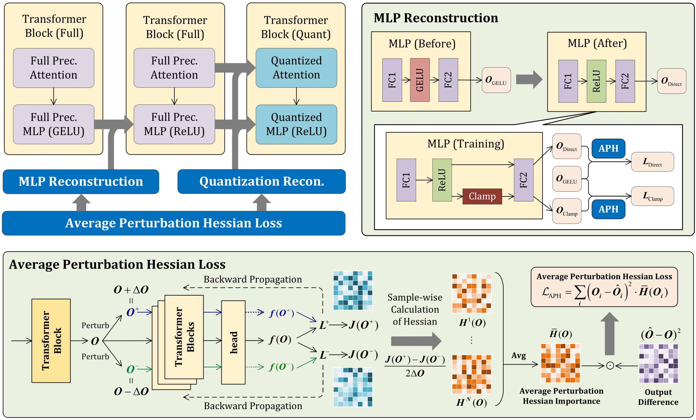

## APHQ-ViT: Post-Training Quantization with Average Perturbation Hessian Based Reconstruction for Vision Transformers

This repository contains the official PyTorch implementation for the CVPR 2025 paper "[APHQ-ViT: Post-Training Quantization with Average Perturbation Hessian Based Reconstruction for Vision Transformers](https://arxiv.org/abs/2504.02508)". The code was modified based on [AdaLog](https://github.com/GoatWu/AdaLog).



## Getting Started

- Clone this repo.

```bash
git clone git@github.com:GoatWu/APHQ-ViT.git
cd APHQ-ViT
```

- Install pytorch and [timm](https://github.com/huggingface/pytorch-image-models/tree/main).
- **Note**: A higher version of pytorch may yield better results. The results reported in our paper were obtained using the following configurations:

```bash
pip install torch==1.10.0 torchvision --index-url https://download.pytorch.org/whl/cu113
pip install timm==0.9.2
```

All the pretrained models can be obtained using timm. You can also directly download the checkpoints we provide. For example:

```bash
wget https://github.com/GoatWu/AdaLog/releases/download/v1.0/deit_tiny_patch16_224.bin
mkdir -p ./checkpoint/vit_raw/
mv deit_tiny_patch16_224.bin ./checkpoint/vit_raw/
```

For more details on setting up and running the quantization of detection models, please refer to [Object-Detection/README.md](https://github.com/GoatWu/APHQ-ViT/blob/master/Object-Detection/README.md)

## Evaluation

You can quantize and evaluate a single model using the following command:

```bash
python test_quant.py --model <MODEL> --config <CONFIG_FILE> --dataset <DATA_DIR> [--reconstruct-mlp] [--load-reconstruct-checkpoint <RECON_CKPT>] [--calibrate] [--load-calibrate-checkpoint <CALIB_CKPT>] [--optimize]
```

- `--model <MODEL>`: Model architecture, which can be `deit_tiny`, `deit_small`, `deit_base`, `vit_tiny`, `vit_small`, `vit_base`, `swin_tiny`, `swin_small` and `swin_base`.

- `--config <CONFIG_FILE>`: Path to the model quantization configuration file.

- `--dataset <DATA_DIR>`: Path to ImageNet dataset.

- `--reconstruct-mlp`: Wether to use MLP reconstruction.

- `--load-reconstruct-checkpoint <CALIB_CKPT>`: When using `--reconstruct-mlp`, we can directly load a reconstructed checkpoint.

- `--calibrate` and `--load-calibrate-checkpoint <CALIB_CKPT>`: A `mutually_exclusive_group` to choose between quantizing an existing model or directly load a calibrated model. The default selection is `--calibrate`.

- `--optimize`: Whether to perform Adaround optimization after calibration.

Example: Optimize the model after reconstruction and calibration.

```bash
python test_quant.py --model vit_small --config ./configs/3bit/best.py --dataset ~/data/ILSVRC/Data/CLS-LOC --val-batchsize 500 --reconstruct-mlp --calibrate --optimize
```

Example: Load a reconstructed checkpoint, then run calibration and optimization.

```bash
python test_quant.py --model vit_small --config ./configs/3bit/best.py --dataset ~/data/ILSVRC/Data/CLS-LOC --val-batchsize 500 --reconstruct-mlp --load-reconstruct-checkpoint ./checkpoints/quant_result/deit_tiny_reconstructed.pth --calibrate --optimize
```

Example: Load a calibrated checkpoint, and then run optimization.

```bash
python test_quant.py --model vit_small --config ./configs/3bit/best.py --dataset ~/data/ILSVRC/Data/CLS-LOC --val-batchsize 500 --reconstruct-mlp --load-calibrate-checkpoint ./checkpoints/quant_result/deit_tiny_w3_a3_calibsize_128_mse.pth --optimize
```

## Results

Below are the experimental results of our proposed APHQ-ViT that you should get on the ImageNet dataset. Checkpoints are available in [Google Drive](https://drive.google.com/drive/folders/1w6KOlOmkx6HoTPFBJCk1mMN_ltsfYuai?usp=drive_link).

| Model | **Full Prec.** | **MLP Recon.** | **W4/A4** | **W3/A3** |
|:----------:|:--------------:|:--------------:|:---------:|:---------:|
| **ViT-S**  | 81.39          | 80.90          | 76.07     | 63.17     |
| **ViT-B**  | 84.54          | 84.84          | 82.41     | 76.31     |
| **DeiT-T** | 72.21          | 71.07          | 66.66     | 55.42     |
| **DeiT-S** | 79.85          | 79.38          | 76.40     | 68.76     |
| **DeiT-B** | 81.80          | 81.43          | 80.21     | 76.30     |
| **Swin-S** | 83.23          | 83.12          | 81.81     | 76.10     |
| **Swin-B** | 85.27          | 84.97          | 83.42     | 78.14     |

## Citation

If you find our work useful in your research, please consider citing:

```bibtex
@inproceedings{wu2025aphqvit,
title={APHQ-ViT: Post-Training Quantization with Average Perturbation Hessian Based Reconstruction for Vision Transformers},
author={Wu, Zhuguanyu and Zhang, Jiayi and Chen, Jiaxin and Guo, Jinyang and Huang, Di and Wang, Yunhong},
booktitle={IEEE/CVF Conference on Computer Vision and Pattern Recognition (CVPR)},
year={2025}
}
```
